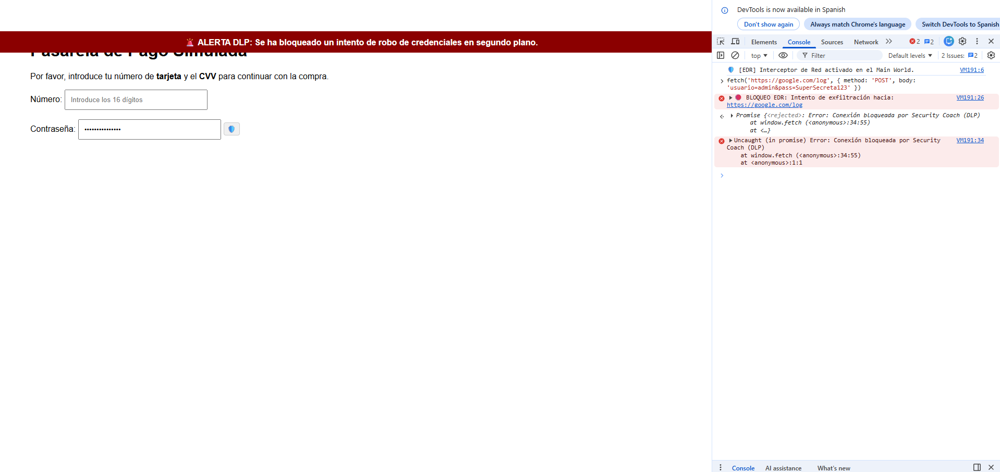
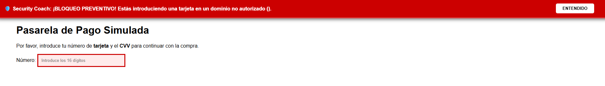
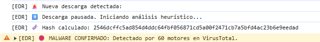
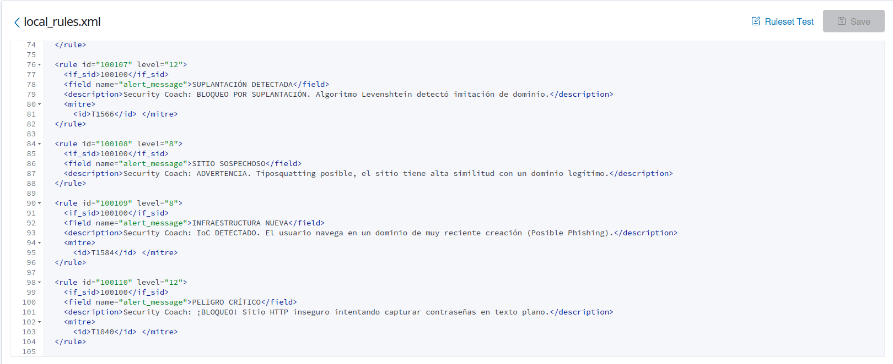
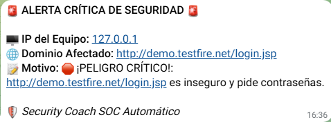
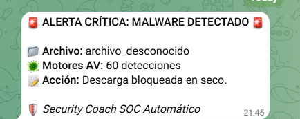

# 🛡️ Security Coach - Enterprise EDR & SOC Integration


**Security Coach** es una solución de ciberseguridad corporativa compuesta por un agente EDR ligero (Extensión de Chrome) y un motor de análisis Backend (Python/FastAPI). Su objetivo es auditar, detectar y mitigar amenazas web y malware en tiempo real, operando bajo principios de privacidad por diseño (*Privacy by Design*) e integrando su telemetría directamente con SIEM corporativos (Wazuh).

### 📸 Galería del Proyecto y Capacidades Técnicas

**1. Motor Anti-Exfiltración (API Hooking & DLP)**


**2. Algoritmo de Luhn (Protección Financiera)**


**3. Interceptación de Malware en vivo (VirusTotal)**


**4. Integración SIEM (Wazuh & MITRE ATT&CK)**


**5. Notificaciones ChatOps (Integración SOC)**



---

## ✨ Características Principales

### 👁️ Agente Frontend (Extensión Chrome)
* **API Hooking & Anti-XSS (DLP):** Asumir que una web con candado es segura es un error. Este módulo de *Data Loss Prevention* opera en la memoria del navegador inyectando un *API Hook* que secuestra la función nativa `fetch()`. Si un script malicioso (XSS) intenta hacer una petición oculta para exfiltrar credenciales hacia un servidor no confiable, el EDR intercepta el *payload* y bloquea la conexión al instante. Además, restringe el copiado al portapapeles en campos sensibles.
* **Interceptor de Malware:** Integración con el motor de descargas nativo. Pausa descargas en progreso, calcula su hash SHA-256 en memoria (HTML5 Crypto) y las cancela definitivamente si la inteligencia del backend confirma que es malware.
* **Protección Financiera (Algoritmo de Luhn):** Monitoriza el DOM para detectar el tecleo de tarjetas de crédito. Valida la tarjeta matemáticamente y bloquea la navegación preventivamente si el dominio no es una pasarela de pago autorizada.
* **Vigilante K-Anonymity (HIBP):** Inspecciona contraseñas y consulta la API de *Have I Been Pwned* enviando solo el prefijo del hash SHA-1, garantizando Zero-Trust.

### 🧠 Motor de Amenazas Backend (FastAPI)
* **Threat Intelligence Global:** Integración nativa asíncrona con las APIs de *Google Safe Browsing* y *VirusTotal* (v3).
* **Inteligencia de Dominios (WHOIS):** Consulta automatizada de la fecha de registro (`Creation Date`) para advertir y bloquear dominios de reciente creación (NRD), un IoC crítico en campañas de Phishing.
* **Heurística Typosquatting:** Algoritmo de distancia de *Levenshtein* para identificar suplantaciones y filtro Anti-Homógrafos (*Punycode*).
* **Data Masking (Privacidad):** Sanitización de URLs antes del almacenamiento (*Logging*), censurando PII y tokens (`password`, `session`).

### 🏢 Gestión Enterprise y SOC
* **Despliegue Centralizado (Active Directory):** Diseñado para ser desplegado vía GPO (*ExtensionInstallForcelist*) e IIS en dominios Windows Server.
* **Integración Wazuh SIEM:** Generación de logs estructurados en JSON. Incluye diccionario de reglas XML mapeadas directamente al framework **MITRE ATT&CK** (T1566, T1110, T1567).
* **ChatOps:** Envío de *Webhooks* vía Telegram para incidentes críticos L12.

---

## 🚀 Instalación y Despliegue Local

### 1. Preparar el Backend (Servidor SOC)
```bash
# Clonar el repositorio
git clone [https://github.com/xXMurallaXx/security-coach.git](https://github.com/xXMurallaXx/security-coach.git)
cd security-coach/backend

# Crear y activar entorno virtual
python -m venv venv
# En Windows:
.\venv\Scripts\activate
# En Linux/Mac:
source venv/bin/activate

# Instalar dependencias
pip install -r requirements.txt

# Configurar variables de entorno
# Renombra el archivo de ejemplo o crea un archivo .env en la carpeta backend:
TELEGRAM_BOT_TOKEN="tu_token_aqui"
TELEGRAM_CHAT_ID="tu_chat_id_aqui"
GOOGLE_API_KEY="tu_clave_seguridad_google"
VIRUSTOTAL_API_KEY="tu_clave_virustotal"

# Arrancar el motor EDR
uvicorn app.main:app --reload --port 8001